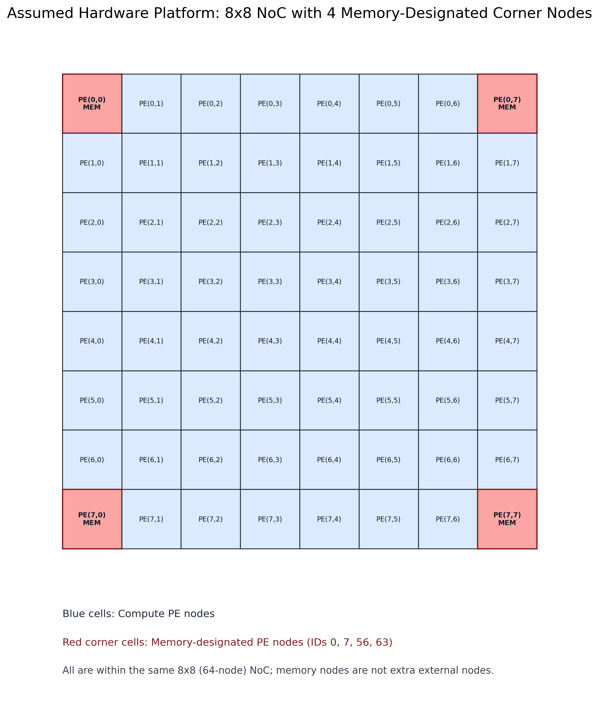
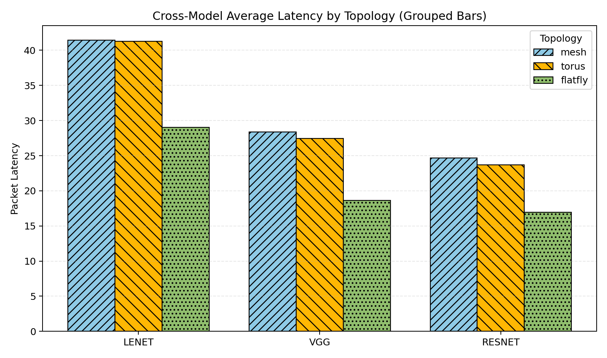
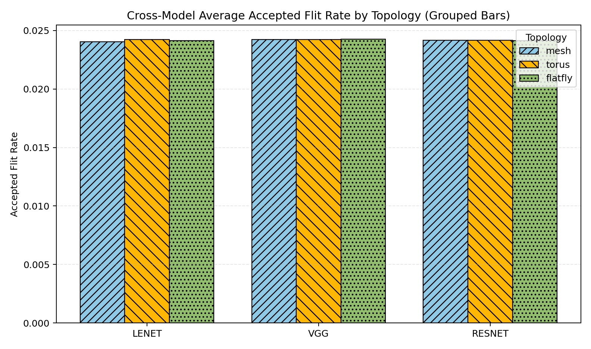
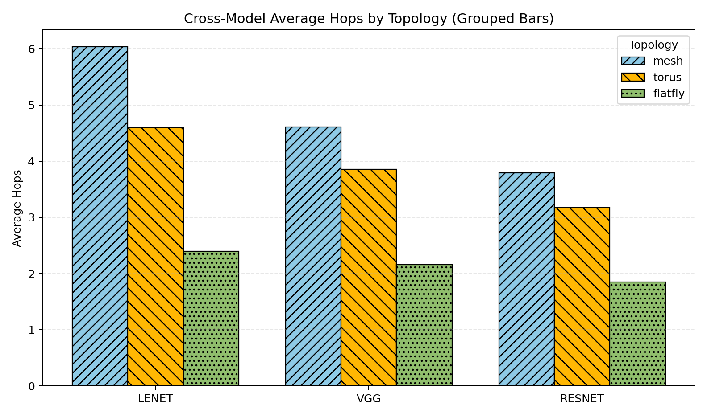
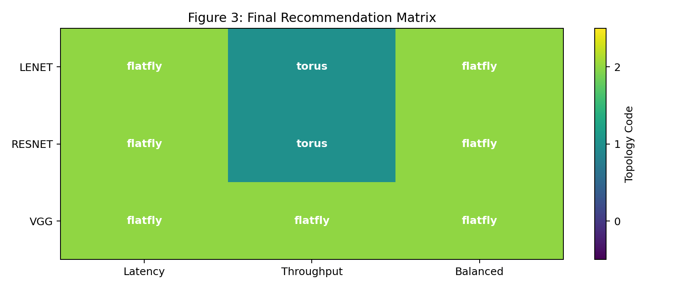

# DNN-NoC-Sim

Cycle-accurate, trace-driven Network-on-Chip (NoC) evaluation for DNN accelerators using BookSim2.

This repository compares **Mesh**, **Torus**, and **Flattened Butterfly (Flatfly)** topologies on a fixed 64-PE platform using model-zoo communication traces from **LeNet**, **VGG**, and **ResNet**.

## Why This Project Matters

As accelerator arrays scale, data movement becomes a first-order bottleneck. This project gives a practical, reproducible pipeline to answer one key question:

**Which NoC topology gives the best communication behavior for realistic DNN traffic at a fixed operating point?**

Core characteristics:

- Fixed hardware profile (8x8, 64 PEs) to isolate topology effects
- Trace-driven traffic derived from real model execution order and tensor shapes
- Multi-seed statistical reporting (5 runs per point by default)
- Cross-model comparison and publication-ready plots

---

## Visual Overview

### Assumed Hardware Platform



### Cross-Model Latency



### Cross-Model Throughput (Accepted Flit Rate)



### Cross-Model Average Hops



### Topology Recommendation Matrix



---

## Key Result Snapshot (Fixed Injection Rate = 0.006)

From `results/combined_runs_averaged.csv`:

| Model  | Topology | Packet Latency | Accepted Flit Rate | Hops Avg |
|--------|----------|----------------|--------------------|----------|
| LeNet  | Flatfly  | 29.0343        | 0.024123           | 2.3936   |
| LeNet  | Mesh     | 41.4283        | 0.024045           | 6.0337   |
| LeNet  | Torus    | 41.2925        | 0.024232           | 4.5980   |
| VGG    | Flatfly  | 18.6507        | 0.024250           | 2.1582   |
| VGG    | Mesh     | 28.3640        | 0.024239           | 4.6066   |
| VGG    | Torus    | 27.4351        | 0.024239           | 3.8530   |
| ResNet | Flatfly  | 16.9381        | 0.024138           | 1.8486   |
| ResNet | Mesh     | 24.6969        | 0.024150           | 3.7886   |
| ResNet | Torus    | 23.6789        | 0.024152           | 3.1711   |

High-level conclusion at this operating point:

- Flatfly gives the lowest latency and lowest hop count across all three models.
- Accepted flit rate is very close across topologies, so latency/hops drive the decision here.

---

## Project Structure

```text
dnn-noc-sim/
|- run_model_zoo_study.py        # End-to-end model-zoo study runner
|- run_trace_noc_study.py        # Generic trace-driven BookSim runner
|- pytorch_strict_mapper.py      # PyTorch layer capture + strict tiled mapping
|- hardware_config.py            # Fixed hardware/NoC assumptions
|- booksim2/                     # BookSim2 source and configs
|- figures/                      # Curated report figures for documentation
`- results/                      # Generated CSV, JSON, plots, insights
```

---

## Methodology at a Glance

1. Build model traces from PyTorch (`lenet`, `vgg`, `resnet`) using strict tiled mapping.
2. Convert layer-wise dependencies into phase-based communication edges `(src, dst, weight)`.
3. Replay traces in BookSim2 for each topology at fixed injection and packet settings.
4. Repeat per point across multiple seeds (default: 5) and aggregate statistics.
5. Export combined tables, summaries, and cross-model plots.

Important fixed assumptions (default):

- Nodes: 64 (8x8)
- Injection rate: 0.006
- Packet size: 4 flits
- Topologies: mesh, torus, flatfly
- Seeds: 5 runs (`seed_start=1`, consecutive)

---

## Setup

## 1) Build BookSim2

```bash
cd booksim2/src
make
cd ../..
```

This should produce the binary at:

- `booksim2/src/booksim`

## 2) Install Python dependencies

Use your preferred environment manager. Minimum required packages are:

- `matplotlib`
- `torch`
- `torchvision`

Example:

```bash
python3 -m pip install matplotlib torch torchvision
```

---

## Reproduce the Main Study

Run from repository root:

```bash
python3 run_model_zoo_study.py \
  --booksim-bin ./booksim2/src/booksim \
  --topologies mesh,torus,flatfly \
  --outdir ./results
```

Expected outputs:

- `results/combined_runs.csv`
- `results/combined_runs_averaged.csv`
- `results/summary.csv`
- `results/summary.json`
- `results/insights.md`
- `results/plots/`
- `results/traces/`

---

## Useful Variants

Change number of stochastic repeats:

```bash
python3 run_model_zoo_study.py \
  --booksim-bin ./booksim2/src/booksim \
  --num-repeats 10 \
  --outdir ./results_10repeats
```

Change tile compression cap during mapping:

```bash
python3 run_model_zoo_study.py \
  --booksim-bin ./booksim2/src/booksim \
  --max-sim-tiles-per-layer 48 \
  --outdir ./results_tiles48
```

Run generic trace-driven sweep directly:

```bash
python3 run_trace_noc_study.py --help
```

---

## How to Read the Results

- `combined_runs.csv`: all successful seed-level runs
- `combined_runs_averaged.csv`: seed-averaged metrics per model/topology point
- `summary.csv`: compact per-model/per-topology summary
- `insights.md`: auto-generated plain-language findings
- `plots/`: per-model and cross-model visual comparisons

Primary metrics:

- `packet_latency_avg` (lower is better)
- `accepted_flit_rate_avg` (higher is better)
- `hops_avg` (lower is better)

---

## Reproducibility Notes

- Keep BookSim binary, topology list, packet size, and injection settings fixed for fair comparisons.
- Use multiple seeds (default 5) to reduce stochastic bias.
- Compare topologies at the same operating point before drawing conclusions.

---

## Citation

If you use this repository, please cite your report and mention:

- BookSim2 simulator
- Trace-driven DNN mapping pipeline in this repo
- Model-zoo topology comparison at fixed 64-node setup

---

## Acknowledgment

This project builds on BookSim2 and standard NoC evaluation methodology, extended here with a strict PyTorch-driven trace generation flow for DNN workloads.